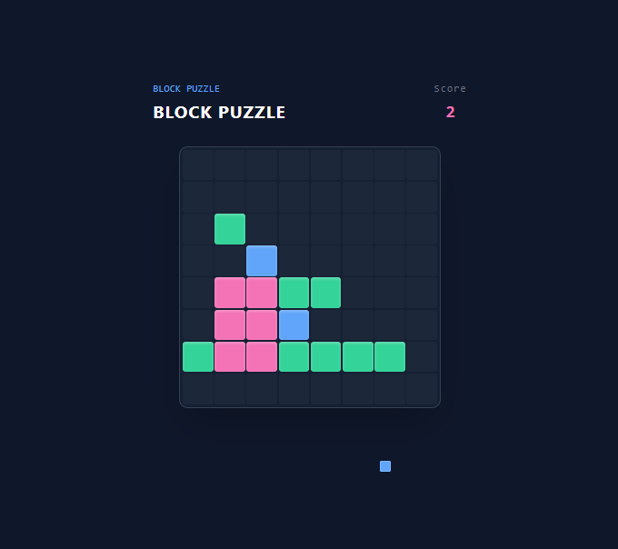
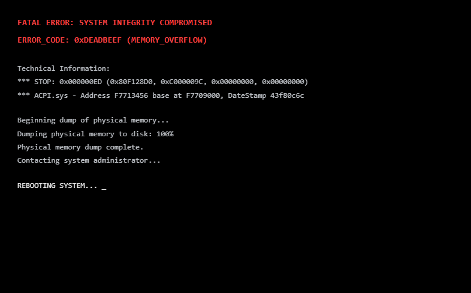
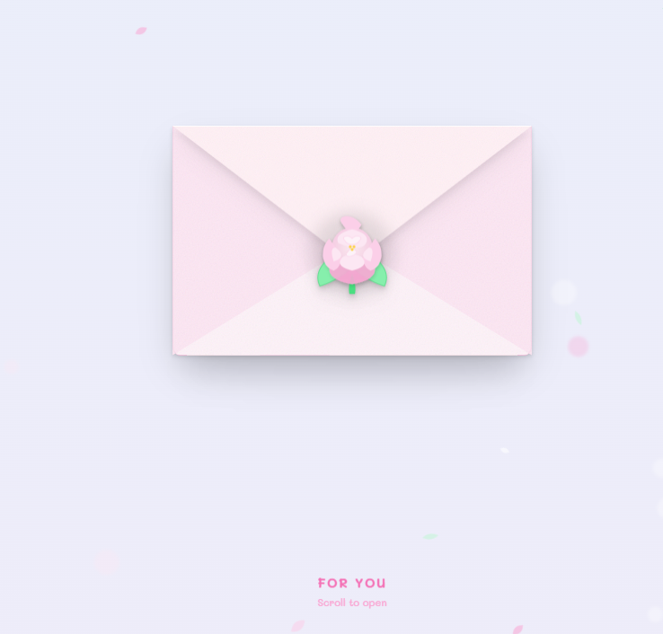
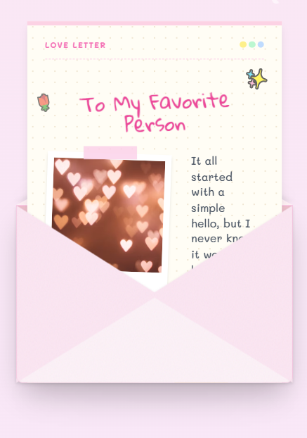
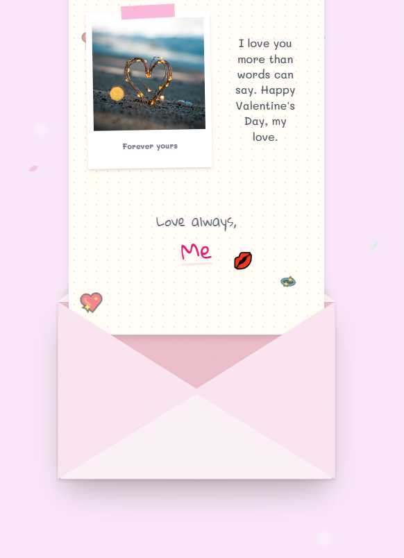

# 💝 Valentine's Day Surprise App

A romantic, interactive web application designed as a unique Valentine's Day gift. This project combines a mini-game, a playful "crash" sequence, and a beautiful scrolling love letter to create a memorable experience.

## ✨ Features

The application flows through three distinct phases:

1.  **Phase 1: The Distraction (Block Puzzle Game)**
    *   A fully functional Tetris-style block puzzle game.
    *   The user plays the game, unsuspecting of the surprise.
    *   **Trigger:** Clearing a specific number of lines triggers the next phase.
    
    

2.  **Phase 2: The "Crash"**
    *   A simulated "Blue Screen of Death" (BSOD) or system crash.
    *   Designed to momentarily confuse/surprise the user.
    *   **Trigger:** A progress bar loads to 100%, transitioning to the reveal.

    

3.  **Phase 3: The Reveal (Love Letter)**
    *   A romantic atmosphere with floating hearts and soft music (optional).
    *   An interactive envelope that opens as the user scrolls.
    *   A long, scrolling love letter containing Polaroid-style photos and personal notes.
    
    
    
    

## 🛠️ Technologies Used

*   **React:** For building the user interface and managing application state.
*   **TypeScript:** For type safety and better code maintainability.
*   **Vite:** For fast development and building.
*   **Tailwind CSS:** For rapid and responsive styling.
*   **Framer Motion:** For smooth, complex animations (envelope opening, scrolling effects, transitions).
*   **Lucide React:** For icons.

## 🚀 How to Run Locally

1.  **Clone the repository:**
    ```bash
    git clone https://github.com/yourusername/valentines-day-surprise.git
    cd ValentinesDay-SurpriseWebsite
    ```

2.  **Install dependencies:**
    ```bash
    npm install
    ```

3.  **Start the development server:**
    ```bash
    npm run dev
    ```

4.  **Open in browser:**
    Navigate to `http://localhost:5173` (or the port shown in your terminal).

## 🎨 Customization

To make this your own:

1.  **Photos & Notes:** Edit `components/Letter.tsx`. Update the `memories` array with your own image URLs and personal messages.
2.  **Game Difficulty:** Adjust the win condition in `components/BlockPuzzleGame.tsx` (look for `linesCleared` threshold).
3.  **Styles:** Modify Tailwind classes in the respective component files to change colors or themes.

## 📄 License

This project is open source and available under the [MIT License](LICENSE).

---
*Made with ❤️ for Valentine's Day*
